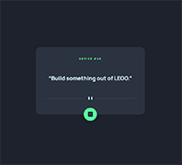

# Frontend Mentor - Advice generator app solution

This is a solution to the [Advice generator app challenge on Frontend Mentor](https://www.frontendmentor.io/challenges/advice-generator-app-QdUG-13db). Frontend Mentor challenges help you improve your coding skills by building realistic projects.

## Table of contents

- [Overview](#overview)
  - [The challenge](#the-challenge)
  - [Screenshot](#screenshot)
  - [Links](#links)
- [My process](#my-process)
  - [Built with](#built-with)
  - [What I learned](#what-i-learned)
  - [Continued development](#continued-development)
  - [Useful resources](#useful-resources)
- [Author](#author)
- [Acknowledgments](#acknowledgments)

## Overview

The challenge was to build out the advice generator app using the Advice Slip API and get it looking as close to the design as possible.

### The challenge

Users should be able to:

- View the optimal layout for the app depending on their device's screen size
- See hover state for the interactive element on the page
- Generate a new piece of advice by clicking the dice icon

*

### Screenshot



### Links

- Solution URL: [https://github.com/allyson-s-code/advice-generator-app](https://github.com/allyson-s-code/advice-generator-app)
- Live Site URL: [https://allyson-s-code.github.io/advice-generator-app/](https://allyson-s-code.github.io/advice-generator-app/)

## My Process

### Built with

- Semantic HTML5 markup
- CSS custom properties
- Flexbox
- Mobile-first workflow
- JavaScript

### What I learned

I really enjoyed this project. Using the given jpeg design files I was able to capture the look and functionality of the app pretty well. I started by creating HTML and mobile-first styles and then added in the necessary styles for desktop. The JavaScript was a small part of the app but I appreciated the simplicity and the practice with fetching from the API.

I also created a glow effect for the first time using CSS and added my own scale change upon click:

```css
button:hover {
  box-shadow: 0 0 20px 10px hsl(150, 100%, 66%, 0.35);
}

button:active {
  transform: scale(0.95);
}
```

### Continued development

I will be continuing my practice with JavaScript and especially working with functions and objects with key value pairs.

### Useful resources

- [MDN Docs Button Accessibility](https://developer.mozilla.org/en-US/docs/Web/Accessibility/ARIA/Roles/button_role) - Constantly learning more about accessbility and in this case the importance of adding the proper `type` for functionality.
- [Free Code Camp- How to Keep Your Footer Where It Belongs](https://www.freecodecamp.org/news/how-to-keep-your-footer-where-it-belongs-59c6aa05c59c/) - This article helped me with the placement of my footer element.

## Author

- Website - [Allyson Smith](https://allyson-s-code.github.io/Web-Dev-Portfolio/)

- Frontend Mentor - [@allyson-s-code](https://www.frontendmentor.io/profile/allyson-s-code)

## Acknowledgments

Thanks to MARCIN GARSKI [@margsoftbf](https://www.frontendmentor.io/profile/margsoftbf) for the beautifully simple solution to displaying the correct size svg (the horizontal line element) using just css and html. I was overcomplicating and looking into scaling the svg using viewbox and/or using js and I came across his solution- changing the `display` attribute on each element depending on media size on the stylesheet. :)
